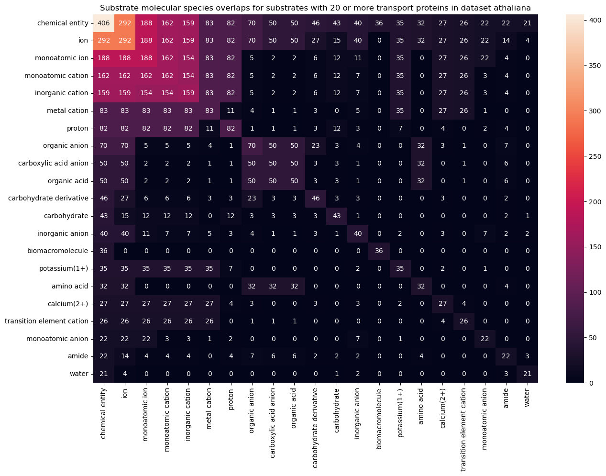
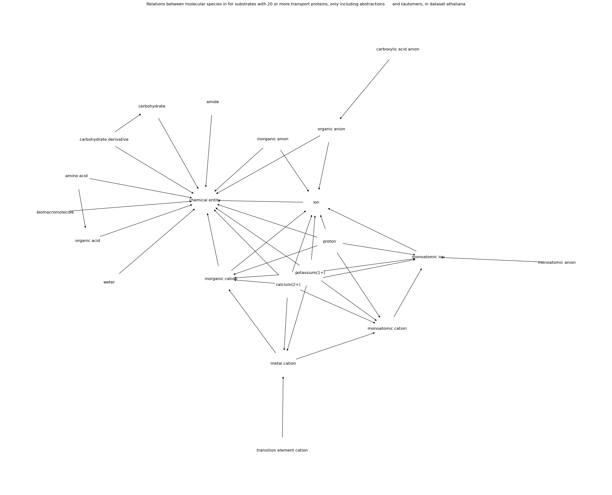

# Analyse der Substratklassen von Transportern

## Ziel

Ziel: Das Finden von Substratklassen mit genügend Samples, am Besten Automatisch. Clustering hat nicht sehr gut funktioniert, vermutlich wegen der Überlappung zwischen den Substratklassen und wegen den verschiedenen Transportmechanismen.

Nun wollte ich diese Überlappungen und die logischen Beziehungen zwischen den Molekülen direkt darstellen, und mit einem Algorithmus die Daten so weit filtern, bis ich bei ca. 10-20 Substratklassen angekommen bin.

Diese Plots habe ich für vier Organismen, und für einen Meta-Datensatz aus allen vier Organismen erstellt.

### Ancestors

Letzte Woche habe ich die Ancestors der jeweiligen Substrate hinzugefügt.

Dazu habe ich ausschließlich “is_a” relations zwischen molekülspezies benutzt, und nur Chebi-Einträge mit 3/3 Sternen benutzt (manuell überprüft).

Vorher hatte ich die Overlap Heatmaps und die Graphen nur mit den Daten erstellt, mit denen die proteine tatsächlich annotiert sind.

So kann es z.B. passieren, dass ein Glucose-Transporter nur als solcher eingetragen ist, allerdings nicht als Hexose/Zucker/Kohlenhydrat-Transporter. Letztere eignen sich wegen der höheren Anzahl an Samples evtl. besser als Substratklassen.

Nun hatte ich das Problem, dass ich hunderttausende zusätzliche Chebi-Terms im Graphen hatte. In mehreren Schritten habe ich diese Daten gefiltert, u.a. nach Substraten mit mehr als 20 Proteinen, und ich habe alle neu hinzugefügten Chebi-Terms entfernt.

Das Entfernen aller neu hinzugefügten Chebi-Terms könnte auch potentielle Substrat-Klassen entfernen. Ich sollte diese wieder hinzufügen, sobald ich eine automatische Methode implementiert habe.

### Idee für Algorithmus

Variablen:

- Adjazenz-Matrix (directed, no labels, bool-Werte)

Wenn ein Chebi-Term einen Overlap von 100% mit einem abstrakteren Chebi-Term hat, dann machen wir einen Eintrag in die Matrix.

Nun hat ein abstrakter Term mit $n$ annotierten Proteinenen drei Arten von Kindern:

1. $i$ Chebi-Terms mit 100% Overlap
    - Erklären $k_1 + \dots + k_i = k$ annotierte Proteine, mit $k < n$
    - Können auch 100% oder weniger Overlap haben mit einem anderem Term
2. $j$ Chebi-Terms mit weniger als 100% Overlap
    - Erklären $l_1 + \dots + l_j = l$
    - Haben evtl. weiteren Parent-Term. Hier macht es einen Unterschied, ob es einen Pfad zwischen den Parents gibt.
3. Restliche Proteine (neuer Knoten)
    - Erklären die restlichen $r = n - k - l$ Proteine.
    - Dieser Knoten muss neu erstellt werden
    - Könnten zu $k$ oder $l$ gehören aber genaues Substrat ist noch nicht bekannt

Nun könnte man die verwandten Chebi-Terms miteinender kombinieren. Als nächstes würde ich mir dazu einen Algorithmus überlegen, der alle Fälle behandelt, um die Chebi-Terms auf 10-20 Substratklassen und dazu gehörigen Proteinen zu reduzieren (TODO).

<!-- Es gibt mehrere mögliche Gründe, warum ein  -->

### Auswertung der Plots

In allen Datensätzen scheint sich ein ähnliches Cluster im **Netzwerk** abzuzeichnen.

- Ionen (alle Organismen)
  - Meist sehr komplex
- Aminosäuren und organische Säuren (alle Organismen)
- Amide und Peptide (alle Organismen)
- Kohlenhydrate (alle Organismen)
- Bio-Makromoleküle (nicht in E. coli)
- Nucleotide und Phosphate (nur Mensch und Hefe)
- Lipide (Nur Mensch)
- Wasser (Nur A. thaliana)

Die Matrizen/**Heatmaps** sehen nun besser aus, die "chemical entity" ist nun der häufigste Term, was logisch ist. Überraschend ist die Anzahl der Ionen. Im Menschen gibt einen Overlap von 1000/1078 zwischen "chemical entity" und "ion". Außerdem gibt es in allen Datensätzen einen overlap von 100% zwischen Aminosäure und Ion. Das könnte daran liegen, dass es einen Pfad zwischen Aminosäure, bzw. der ionisierten Form eines Moleküls und Ion gibt, oder an einem Fehler in der Pipeline. Als nächstes sollte ich versuchen, das nachzuvollziehen (TODO).

## Arabidopsis thaliana

## Escherichia coli

## Human

## Hefe (S. cerevisiae)

## Meta-Organism (all four together)

