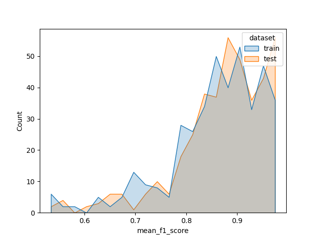
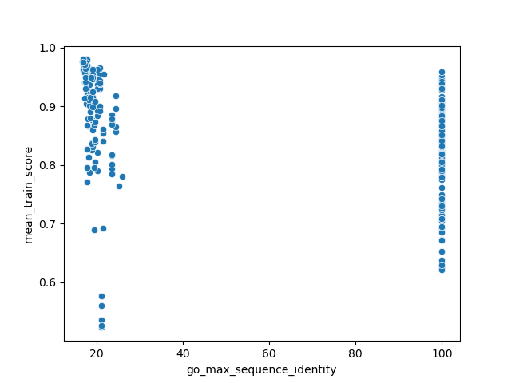
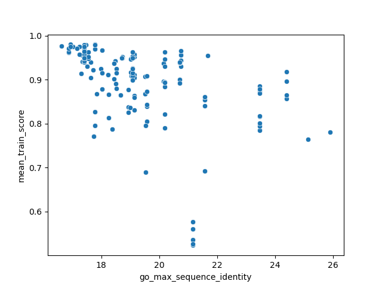
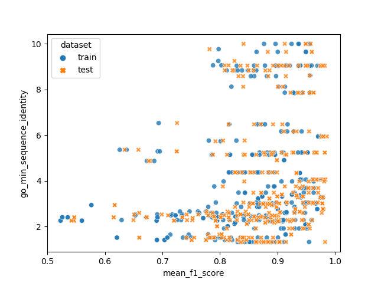
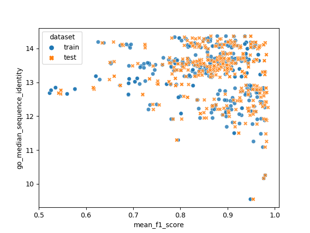
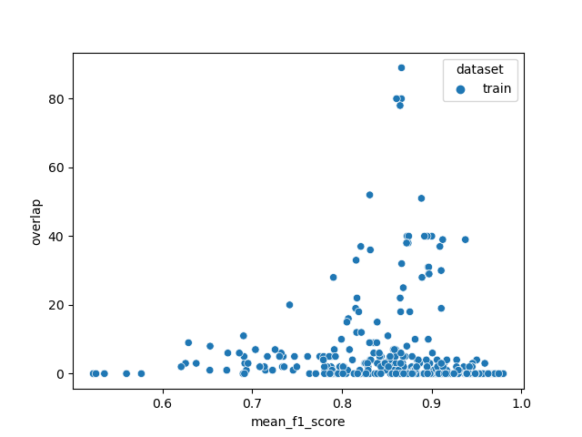

# What determines classification performance of a pair of substrate classes?

``` {=html}
<style>
body { min-width: 50% !important; }
</style>
```

## Overview

On one hand, we have a sub-graph of the Gene Ontology, which contains all GO terms that are descendants of *transmembrane transporter activity*, a molecular function term. On the other hand, we have a set of proteins that are annotated with at least one term in that sub-graph. The task is to predict the transport function term or terms with which a particular protein is annotated.

There are two issues: There are too many terms for multiclass classification, and there are too few samples per term. There are approaches that train a classifier for each term in GO, but they don't achieve accuracies above 0.65.

This is called *hierarchical classification*, and there are multiple apporaches:

- Multi-Class classification between all leafs. There are many leafs, and they often have very few samples.
- Find a set of abstract terms with little overlap in terms of descendants and annotated proteins, and put all of their respective descendant terms into a single class
- Train a classifier for each junction in the tree. Since we have to multiply the accuracies, this will automatically become less accurate the more we move down the tree.

## Dataset creation

The dataset creation is abstracted to a point where it only needs a set of organism identifiers, a flag that includes or excludes proteins that have not been manually reviewed (TrEMBL), a flag that can exclude electronically inferred GO terms (useful for organisms that are not model organisms), and the evidence code for the existence of the sequence (proven at transcript level, or proven at protein level).

After filtering the proteins from UniprotKB, a subset of membrane transporter substrate predictions is created:

- The root term is *transmembrane transporter activity*
- We only keep edges that are annotated with *is_a* (direct logical relation)
- Only keep *molecular_function* terms
- Only terms that annotate proteins from our filtered protein set
- Only terms that have the *enables* relation to their protein, which means that the function is directly carried out by the protein. The *part_of* relation only added outliers, like parts of transport protein complexes that don't carry out the transport directly.
- Finally, the each term is annotated with its ancestors, all the way up to the root node, but only using *is_a* edges. This increases the number of samples drastically. For example, a protein annotated with *sugar transmembrane transporter activity* is also annotated with *carbohydrate transmembrane transporter activity*, because there is an *is_a* relation between the two terms.

Lastly, the chebi terms for the GO terms are retrieved from a dataset of cross-ontology relations. ChEBI is a database of biologically relevant molecules, and also an ontology. These can be filtered by 3-star terms, which are manually curated. For our yeast dataset, this did not make a difference. There are two types of cross-ontology relations that are relevant: *has_primary_input* typically denotes the transported substrate or substrates, and *has_participant* typically includes other molecules that contribute to the transport, such as ATP or H2O.

In contrast to GO, ChEBI is not acyclid. This means that adding ancestors is not as trivial as with GO, and traversing the graph to find ancestors can often add thousands of terms that have some path to the term we are looking at. Therefore, we decided against using ChEBI terms and the ChEBI ontology directly, and instead see them as annotations for our GO graph.

Another point is that not every GO term has its appropriate ChEBI term in the database. For example, there is a ChEBI term for *Ion*, but the *monoatomic ion transmembrane transport* GO term is not annotated with that.

## Stats

For our test notebook, we created a dataset of *S. cerevisiae* transporters, with the following parameters:

```python
    ORGANISM_IDS={559292}
    SWISSPROT_ONLY=False
    MAX_SEQUENCE_EVIDENCE_CODE = 1  # Only evidence at protein level
    EXCLUDE_IEA_GO_TERMS=False
```

The yeast dataset contains:

- 322 unique proteins before filtering out similar sequences with cd-hit.
- 288 unique GO terms related to *transmembrane transporter activity*, after adding ancestors
- 211 unique GO terms related to *transmembrane transporter activity*, *before* adding ancestors
- 226 GO term are annotated with ChEBI terms
- 181 unique ChEBI terms (some of them abstract, not directly usable)
- 89 unique ChEBI terms that are usable for Tanimoto coefficient (which usually means they are concrete molecules, not abstract terms)
- 131 unique GO terms annotated to the 89 ChEBI terms that are usable for Tanimoto coefficient
- 36 GO terms with more than 20 samples per class and at least 20 unique proteins per class (i.e. usable for ML). We could try going down to at least 15 unique proteins per class.

## Matrices

There are three types of matrices: Those calculated for GO terms based on their annotations, those directly created for their annotated ChEBI terms, and those with the evaluation results of the ML models.

### GO pairwise score matrices

- Adjacency matrix: binary relations between GO terms, only using *is_a* relations. **$288 \times 288$**
- Overlap matrix of GO terms, i.e. how many proteins two terms have in common. **$288 \times 288$**
- Semantic similarity matrices. **$288 \times 288$**
  - Wang similarity algorithm: Fast, parallel
  - TODO: other five algorithms (only one core, takes very long)
- Sequence scores. **$288 \times 288$**, 8 matrices
  - Sequence identity between proteins annotated with GO terms. Identity function: (identical positions) / (aligned positions + internal gap positions)
  - Needleman-Wunsch alignment score between sequences
  - Aggr. functions: mean, median, max, min
- Tanimoto coefficients between ChEBI terms related to GO terms. **$131 \times 131$** 16 matrices
  - Fingerprint algorithms: Morgan, atom pairs, topological torsions, MACCS
  - Aggr. functions: mean, median, max, min
  - Problem: GO terms with enough proteins for ML are too abstract to have concrete ChEBI terms, only two molecules available for a total of 12/36 terms

### ChEBI matrices

- ChEBI adjacency matrix of ChEBI terms directly annotated to ancestor GO terms **$159 \times 159$**
- ChEBI overlap matrix (of proteins related to go terms related to ChEBI terms) **$159 \times 159$**
- Tanimoto coefficients **$89 \times 89$**, four matrices

### ML results matrices

- GO terms Machine learning F1 score matrices **$36 \times 36$**
  - SVM pipeline with no feature selection, all 1600 features
    - training scores
    - test scores
    - Matrices are asymetrical: score (i,j) is classification if GO term i is positive class, and GO term j is negative class. The average of i,j and j,i is the macro-averaged F1 score.
    - For comparison with other matrices, the matrices were macro-averaged.
  - SVM pipeline with feature selection TODO
  - SVM pipeline with PCA TODO

## Analysis

To analyze the relationships between the pairwise scores, we combined them into a dataframe where each row corresponds to a unique pair of GO terms, and the columns to their corresponding values in the matrices. This dataframe only contains pairs for which a ML model was able to be trained, i.e. with at least 20 samples, and at least 20 unique samples (in case of overlapping proteins annotated with both GO terms).

The adjacency matrix was excluded, because no pairs of GO terms with enough samples had a connection in that matrix. In the future, it could be a good idea to create a different matrix that contains the similarity of two terms in the GO hierarchy, for example the distance of the closest common ancestor (NetworkX has algorithms for that).

### Stats of combined dataframe

|                                    |   count |     mean |     std |      min |      25% |      50% |      75% |      max |
|:-----------------------------------|--------:|---------:|--------:|---------:|---------:|---------:|---------:|---------:|
| mean_train_score                   |     404 |     0.86 |    0.09 |     0.52 |     0.82 |     0.87 |     0.93 |     0.98 |
| mean_test_score                    |     404 |     0.87 |    0.09 |     0.54 |     0.83 |     0.89 |     0.94 |     0.99 |
| class1_n_samples                   |     404 |    52.05 |   37.6  |    21    |    22    |    33    |    78    |   158    |
| class2_n_samples                   |     404 |    48.78 |   33.11 |    21    |    25    |    32    |    64    |   158    |
| overlap                            |     404 |     4.86 |   11.82 |     0    |     0    |     0    |     3.25 |    89    |
| semantic_sim_wang                  |     404 |     0.37 |    0.13 |     0.13 |     0.27 |     0.35 |     0.45 |     0.74 |
| go_median_sequence_identity        |     404 |    13.26 |    0.76 |     9.55 |    12.82 |    13.41 |    13.7  |    14.37 |
| go_mean_sequence_identity          |     404 |    12.96 |    0.92 |     9.4  |    12.33 |    12.97 |    13.56 |    15.84 |
| go_max_sequence_identity           |     404 |    59.06 |   40.41 |    16.62 |    18.98 |    24.41 |   100    |   100    |
| go_min_sequence_identity           |     404 |     3.93 |    2.47 |     1.33 |     2.29 |     3.01 |     5.17 |    10    |
| go_median_sequence_alignment_score |     404 | -1129.41 |  520.36 | -3426    | -1179.5  |  -949    |  -883.25 |  -425.5  |
| go_mean_sequence_alignment_score   |     404 | -1349.23 |  488.31 | -3356.48 | -1580.94 | -1229.41 | -1030.23 |  -602.91 |
| go_max_sequence_alignment_score    |     404 |  2483.14 | 3233.31 |  -451    |  -175    |   111    |  5091    | 10676    |
| go_min_sequence_alignment_score    |     404 | -5512.98 | 1709.78 | -7903    | -6794    | -5687    | -4255    | -2082    |
| tanimoto_morgan_go_mean            |       6 |     0    |    0    |     0    |     0    |     0    |     0    |     0    |
| tanimoto_morgan_go_median          |       6 |     0    |    0    |     0    |     0    |     0    |     0    |     0    |
| tanimoto_morgan_go_min             |       6 |     0    |    0    |     0    |     0    |     0    |     0    |     0    |
| tanimoto_morgan_go_max             |       6 |     0    |    0    |     0    |     0    |     0    |     0    |     0    |
| tanimoto_atompairs_go_mean         |       6 |     0    |    0    |     0    |     0    |     0    |     0    |     0    |
| tanimoto_atompairs_go_median       |       6 |     0    |    0    |     0    |     0    |     0    |     0    |     0    |
| tanimoto_atompairs_go_min          |       6 |     0    |    0    |     0    |     0    |     0    |     0    |     0    |
| tanimoto_atompairs_go_max          |       6 |     0    |    0    |     0    |     0    |     0    |     0    |     0    |
| tanimoto_torsions_go_mean          |       6 |     0.5  |    0.55 |     0    |     0    |     0.5  |     1    |     1    |
| tanimoto_torsions_go_median        |       6 |     0.5  |    0.55 |     0    |     0    |     0.5  |     1    |     1    |
| tanimoto_torsions_go_min           |       6 |     0.5  |    0.55 |     0    |     0    |     0.5  |     1    |     1    |
| tanimoto_torsions_go_max           |       6 |     0.5  |    0.55 |     0    |     0    |     0.5  |     1    |     1    |
| tanimoto_maccs_go_mean             |       6 |     0.1  |    0.02 |     0.08 |     0.08 |     0.1  |     0.12 |     0.12 |
| tanimoto_maccs_go_median           |       6 |     0.1  |    0.02 |     0.08 |     0.08 |     0.1  |     0.12 |     0.12 |
| tanimoto_maccs_go_min              |       6 |     0.1  |    0.02 |     0.08 |     0.08 |     0.1  |     0.12 |     0.12 |
| tanimoto_maccs_go_max              |       6 |     0.1  |    0.02 |     0.08 |     0.08 |     0.1  |     0.12 |     0.12 |


The ML scores look good, the max average F1 score is 0.99, the min is .52, and the 50th percentile is already at 0.89.

Mean sequence identities seem to be very low, with an average of just 13.3, standard deviation of 0.76 and max of 14.37. We are only looking at classes with at least 20 unique proteins per class, so this also makes sense.

Tanimoto scores are only available for six pairs of GO terms. This is because we are looking at GO terms with many samples, which means they are abstract GO terms, which means they are annotated with abstract ChEBI terms with no actual atoms to calculate the molecular fingerprints from. 89 out of 181 ChEBI terms have fingerprints, which is roughly how many are actual molecules.

#### F1 Score distribution



Most GO term pairs with enough samples to be included (at least 20 unique proteins per class) have good scores (above 0.8). It would be interesting to look at lower thresholds than 20, and compare that to the number of classes available at that threshold.

#### 10 Highest-ranking pairs

When looking at the GO pairs that produce the highest-scoring models, they mostly seem to distinguish between transport mechanisms. Primary-active ABC transporters are separated from different types of secondary active transporters, symporters are separated from protein transporters. This makes sense, since the corresponding proteins actually are quite dissimilar.

| go_id1                                                            | go_id2                                            |   mean_train_score |   mean_test_score |   class1_n_samples |   class2_n_samples |   overlap |   semantic_sim_wang |   go_median_sequence_identity |   go_mean_sequence_identity |
|:------------------------------------------------------------------|:--------------------------------------------------|-------------------:|------------------:|-------------------:|-------------------:|----------:|--------------------:|------------------------------:|----------------------------:|
| symporter activity                                                | macromolecule transmembrane transporter activity  |              0.98  |             0.98  |                 38 |                 21 |         0 |               0.255 |                        13.309 |                      12.499 |
| protein transmembrane transporter activity                        | symporter activity                                |              0.98  |             0.98  |                 21 |                 38 |         0 |               0.226 |                        13.309 |                      12.498 |
| nucleobase-containing compound transmembrane transporter activity | ABC-type transporter activity                     |              0.98  |             0.98  |                 25 |                 22 |         0 |               0.17  |                        10.254 |                      10.627 |
| solute:proton symporter activity                                  | macromolecule transmembrane transporter activity  |              0.979 |             0.979 |                 32 |                 21 |         0 |               0.233 |                        13.309 |                      12.529 |
| protein transmembrane transporter activity                        | solute:proton symporter activity                  |              0.979 |             0.979 |                 21 |                 32 |         0 |               0.204 |                        13.309 |                      12.527 |
| secondary active transmembrane transporter activity               | ABC-type transporter activity                     |              0.979 |             0.986 |                 80 |                 22 |         0 |               0.36  |                        12.258 |                      12.155 |
| amino acid transmembrane transporter activity                     | ABC-type transporter activity                     |              0.979 |             0.983 |                 40 |                 22 |         0 |               0.149 |                        11.876 |                      11.769 |
| organophosphate ester transmembrane transporter activity          | ABC-type transporter activity                     |              0.977 |             0.977 |                 22 |                 22 |         0 |               0.17  |                        10.164 |                      10.62  |
| carbohydrate:monoatomic cation symporter activity                 | primary active transmembrane transporter activity |              0.976 |             0.982 |                 22 |                 61 |         0 |               0.282 |                        12.832 |                      12.556 |
| carbohydrate:proton symporter activity                            | primary active transmembrane transporter activity |              0.976 |             0.982 |                 22 |                 61 |         0 |               0.248 |                        12.832 |                      12.556 |

#### 10 Lowest-ranking pairs

The lowest-ranking pairs seem to involve one GO term with barely enough proteins, and one with many proteins. It is also interesting that the 10 worst pairs are always one protein/macromolecule transport function GO term, and one monoatomic ion transport function. Maybe protein transporters use ions for their transport? Or maybe they are outliers, and our feature encodings are not as suitable for them. TODO

The lowest-ranking pairs also have average semantic similarities that are on average about twice as high as those of the top 10 pairs. There does not see to be a big difference in median sequence identity.

| go_id1                                                        | go_id2                                                        |   mean_train_score |   mean_test_score |   class1_n_samples |   class2_n_samples |   overlap |   semantic_sim_wang |   go_median_sequence_identity |   go_mean_sequence_identity |
|:--------------------------------------------------------------|:--------------------------------------------------------------|-------------------:|------------------:|-------------------:|-------------------:|----------:|--------------------:|------------------------------:|----------------------------:|
| protein transmembrane transporter activity                    | monoatomic ion transmembrane transporter activity             |              0.523 |             0.542 |                 21 |                142 |         0 |               0.498 |                        12.681 |                      11.896 |
| monoatomic ion transmembrane transporter activity             | macromolecule transmembrane transporter activity              |              0.523 |             0.542 |                142 |                 21 |         0 |               0.689 |                        12.682 |                      11.898 |
| macromolecule transmembrane transporter activity              | inorganic cation transmembrane transporter activity           |              0.526 |             0.547 |                 21 |                133 |         0 |               0.406 |                        12.766 |                      11.986 |
| protein transmembrane transporter activity                    | inorganic cation transmembrane transporter activity           |              0.526 |             0.547 |                 21 |                133 |         0 |               0.322 |                        12.766 |                      11.986 |
| protein transmembrane transporter activity                    | inorganic molecular entity transmembrane transporter activity |              0.535 |             0.615 |                 21 |                158 |         0 |               0.333 |                        12.843 |                      12.035 |
| inorganic molecular entity transmembrane transporter activity | macromolecule transmembrane transporter activity              |              0.535 |             0.615 |                158 |                 21 |         0 |               0.417 |                        12.843 |                      12.037 |
| monoatomic cation transmembrane transporter activity          | macromolecule transmembrane transporter activity              |              0.56  |             0.546 |                131 |                 21 |         0 |               0.527 |                        12.658 |                      11.872 |
| protein transmembrane transporter activity                    | monoatomic cation transmembrane transporter activity          |              0.56  |             0.546 |                 21 |                131 |         0 |               0.393 |                        12.658 |                      11.87  |
| proton transmembrane transporter activity                     | macromolecule transmembrane transporter activity              |              0.576 |             0.617 |                 78 |                 21 |         0 |               0.348 |                        12.804 |                      12.037 |
| protein transmembrane transporter activity                    | proton transmembrane transporter activity                     |              0.576 |             0.617 |                 21 |                 78 |         0 |               0.279 |                        12.793 |                      12.034 |

### Pearson and Kendall correlation between matrices and train/test score

Including Kendall, since some variables are not normally distributed:

|                                    |   f1_train_pearson |   f1_test_pearson |   f1_train_kendall |   f1_test_kendall |
|:-----------------------------------|-------------------:|------------------:|-------------------:|------------------:|
| mean_train_score                   |              1     |             0.971 |              1     |             0.856 |
| mean_test_score                    |              0.971 |             1     |              0.856 |             1     |
| class1_n_samples                   |             -0.282 |            -0.249 |             -0.214 |            -0.191 |
| class2_n_samples                   |             -0.24  |            -0.23  |             -0.137 |            -0.126 |
| overlap                            |             -0.029 |            -0.047 |             -0.281 |            -0.284 |
| semantic_sim_wang                  |             -0.282 |            -0.257 |             -0.232 |            -0.214 |
| go_median_sequence_identity        |             -0.056 |            -0.062 |             -0.02  |            -0.028 |
| go_mean_sequence_identity          |              0.043 |             0.023 |             -0.012 |            -0.024 |
| go_max_sequence_identity           |             -0.317 |            -0.285 |             -0.406 |            -0.378 |
| go_min_sequence_identity           |              0.305 |             0.275 |              0.26  |             0.25  |
| go_median_sequence_alignment_score |             -0.245 |            -0.25  |             -0.073 |            -0.072 |
| go_mean_sequence_alignment_score   |             -0.148 |            -0.157 |             -0.007 |            -0.011 |
| go_max_sequence_alignment_score    |             -0.215 |            -0.205 |             -0.372 |            -0.369 |
| go_min_sequence_alignment_score    |              0.451 |             0.425 |              0.347 |             0.329 |
| tanimoto_morgan_go_mean            |            nan     |           nan     |            nan     |           nan     |
| tanimoto_morgan_go_median          |            nan     |           nan     |            nan     |           nan     |
| tanimoto_morgan_go_min             |            nan     |           nan     |            nan     |           nan     |
| tanimoto_morgan_go_max             |            nan     |           nan     |            nan     |           nan     |
| tanimoto_atompairs_go_mean         |            nan     |           nan     |            nan     |           nan     |
| tanimoto_atompairs_go_median       |            nan     |           nan     |            nan     |           nan     |
| tanimoto_atompairs_go_min          |            nan     |           nan     |            nan     |           nan     |
| tanimoto_atompairs_go_max          |            nan     |           nan     |            nan     |           nan     |
| tanimoto_torsions_go_mean          |              0.16  |             0.277 |              0.086 |             0.258 |
| tanimoto_torsions_go_median        |              0.16  |             0.277 |              0.086 |             0.258 |
| tanimoto_torsions_go_min           |              0.16  |             0.277 |              0.086 |             0.258 |
| tanimoto_torsions_go_max           |              0.16  |             0.277 |              0.086 |             0.258 |
| tanimoto_maccs_go_mean             |              0.16  |             0.277 |              0.086 |             0.258 |
| tanimoto_maccs_go_median           |              0.16  |             0.277 |              0.086 |             0.258 |
| tanimoto_maccs_go_min              |              0.16  |             0.277 |              0.086 |             0.258 |
| tanimoto_maccs_go_max              |              0.16  |             0.277 |              0.086 |             0.258 |


Tanimoto can be ignored, since it is only available for six pairs. The strongest correlations with average train and test F1 scores are with the max and min sequence identity. The max identity has a negative correlation and the min identity has a positive correlation.

This dataset also contains proteins with both substrates, in which case the GO term pair has a max sequence identity of 100%. This could be the reason for the negative correlation with the max identity: if a protein is in both classes then the performance is, on average, worse. 

The F1 scores also have a negative Kendall correlation of -0.25 with the overlap, which also shows that overlapping GO terms perform worse on average, but not significantly.

The Wang semantic similarity between the GO terms also has a slightly negative correlation with scores, which makes sense.

#### Max sequence identity

Generally, the max sequence identities are either very low (10%-20%) or 100%, there is nothing in between. Also, there is a high number of go term pairs with 100% max sequence identity and good SVM scores, meaning that the multi-output classification does not lead to significantly worse scores than the binary classification:



If we remove the pairs of GO terms with max sequence identity of 100%, we get a higher kendall correlation of -0.412 to the train score, and -0.368 to the test set:



Which (non-overlapping) GO term pairs have the lowest scores (less than 0.6) in this plot?

| go_id1                                                        | go_id2                                                        |   mean_train_score |
|:--------------------------------------------------------------|:--------------------------------------------------------------|-------------------:|
| protein transmembrane transporter activity                    | monoatomic ion transmembrane transporter activity             |              0.523 |
| monoatomic ion transmembrane transporter activity             | macromolecule transmembrane transporter activity              |              0.523 |
| macromolecule transmembrane transporter activity              | inorganic cation transmembrane transporter activity           |              0.526 |
| protein transmembrane transporter activity                    | inorganic cation transmembrane transporter activity           |              0.526 |
| protein transmembrane transporter activity                    | inorganic molecular entity transmembrane transporter activity |              0.535 |
| inorganic molecular entity transmembrane transporter activity | macromolecule transmembrane transporter activity              |              0.535 |
| monoatomic cation transmembrane transporter activity          | macromolecule transmembrane transporter activity              |              0.56  |
| protein transmembrane transporter activity                    | monoatomic cation transmembrane transporter activity          |              0.56  |
| protein transmembrane transporter activity                    | proton transmembrane transporter activity                     |              0.576 |
| proton transmembrane transporter activity                     | macromolecule transmembrane transporter activity              |              0.576 |
| active monoatomic ion transmembrane transporter activity      | macromolecule transmembrane transporter activity              |              0.69  |
| protein transmembrane transporter activity                    | active monoatomic ion transmembrane transporter activity      |              0.69  |
| protein transmembrane transporter activity                    | salt transmembrane transporter activity                       |              0.691 |
| macromolecule transmembrane transporter activity              | salt transmembrane transporter activity                       |              0.691 |

It seems that all of them are related to protein transport vs. monoatomic ion. In total, there are 31/404 pairs that are annotated with both *protein transmembrane transporter activity* and *macromolecule transmembrane transporter activity* in the dataset, none are annotated with only one of them.

#### Min sequence identity



The lowest F1 scores have the lowest sequence identity, although there are GO pairs with lower identity that have very high scores. Above a certain threshold, there are no more bad models (as in F1 less than 0.8)

#### Median sequence identity



Below a median sequence identity of 12.5%, all models have good performance (could be coincidence?)

#### Overlap



The same plot for the test dataset looks almost identical, but the combined plot was misleading because the orange dots were on top of blue dots. A high overlap does not seem to have much of a negative impact on classification performance with our multi-output SVMs.

## Issues & TODOs

- Only 32/288 GO terms available as classes, most of them relatively abstract
  - Try lower threshold (e.g. only 15 unique proteins per class) to get more GO terms/classes
  - Line plot with number of classes depending on threshold of unique samples per class
  - Histogram of F1 scores at different thresholds (unique samples per class)
- Does score correlate positively with number of unique proteins?
  - Since it correlates negatively with overlap size
  - Create opposite of overlap matrix: Size of difference set
- Adjacency matrix is not working for ML score correlation calculation, since no two go terms in the ML dataset are direct descendants of each other.
  - Come up with other GO graph-based similarity score, like distance of closest common ancestor
  - Or is it good enough to add more semantic similarity measures, they do something similar?
- At the moment, we are using all 1600 feature dimensions and that is not the model we would use in practice.
  - ML models with automatic feature selection and/or PCA.
- Tanimoto matrices are not usable for ML comparison
  - Only 6/404 pairs have them available.
  - Possible solution: Add ChEBI ancestor terms. Problem: Millions of molecules, cyclic ChEBI graph
- All GO semantic similarity measures except Wang (the simplest one that does not use annotation data or information content) throw errors when running them in parallel for loop.
  - On single core, they each take hours to calculate for all pairs
  - Find other way to implement them more efficiently (parallel)
- Filter for multi-substrate proteins, compare performance to single-substrate
- Correlations between other measures (excluding ML scores) could be interesting
